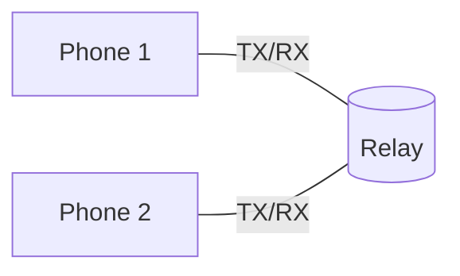
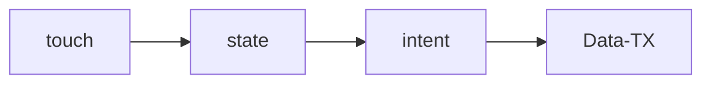
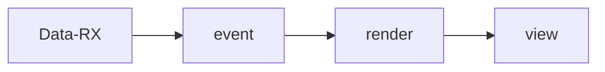
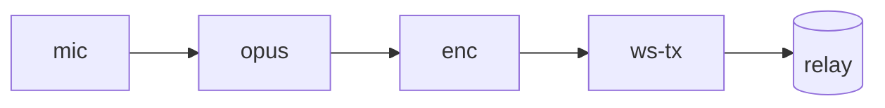
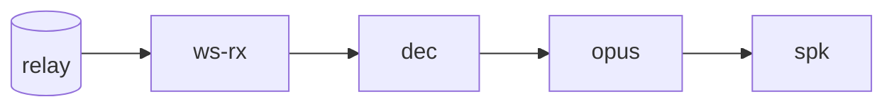
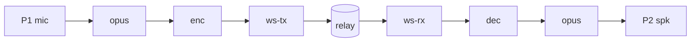
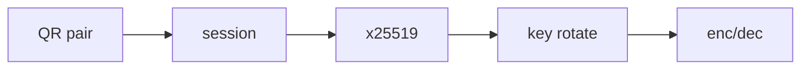
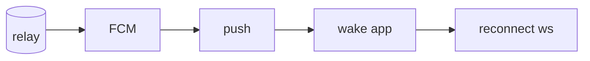

# SassyTalkie — App Data & UI Pathway

> Independent TX and RX structures for both UI and Data planes, mirrored across two channels (Phone 1 ↔ Phone 2).

---

## 1. Overview

- Two physical channels: **Phone 1** and **Phone 2**.[^1]
- Two logical planes per phone: **UI plane** (touch / render) and **Data plane** (audio / signaling / session).[^2]
- Each plane has independent **TX** (transmit) and **RX** (receive) structures — no shared mutable state between TX and RX.[^3]
- Total = **4 structures per phone × 2 phones = 8 independent pipelines**.[^4]

---

## 2. Plane × Direction Matrix

|              | TX                         | RX                         |
|--------------|----------------------------|----------------------------|
| **UI**       | UI-TX[^5]                  | UI-RX[^6]                  |
| **Data**     | Data-TX[^7]                | Data-RX[^8]                |

---

## 3. Phone 1 — UI Plane

### 3.1 UI-TX (Phone 1)

- Touch event → state mutation → outbound intent.
- Sources: PTT key[^9], channel switch, QR scan.

### 3.2 UI-RX (Phone 1)

- Inbound state delta → Compose recomposition → screen render.

---

## 4. Phone 1 — Data Plane

### 4.1 Data-TX (Phone 1)

- Mic capture → Opus encode → AES-GCM encrypt → WS send.[^10]

### 4.2 Data-RX (Phone 1)

- WS recv → AES-GCM decrypt → Opus decode → speaker out.[^11]

---

## 5. Phone 2 — UI Plane

### 5.1 UI-TX (Phone 2)

- Identical structure to §3.1; independent process / state store.

### 5.2 UI-RX (Phone 2)

- Identical structure to §3.2; independent recompose tree.

---

## 6. Phone 2 — Data Plane

### 6.1 Data-TX (Phone 2)

- Mirrors §4.1. Distinct WS connection, distinct AES nonce stream.[^12]

### 6.2 Data-RX (Phone 2)

- Mirrors §4.2. Distinct decoder + jitter buffer.

---

## 7. End-to-End — Full Audio Path (Phone 1 → Phone 2)

- Reverse path (P2 → P1) is symmetric and concurrent — see §6.1 → §4.2.[^13]

---

## 8. End-to-End — Control / Session Path

- Session keys rotated on a fixed cadence; rotation events do not interrupt active TX/RX.[^14]
- Pairing artifacts persist in `EncryptedSharedPreferences` (Android Keystore-backed).[^15]

---

## 9. Isolation Guarantees

- UI-TX and UI-RX share no mutable state — UI-RX is render-only from immutable events.[^16]
- Data-TX and Data-RX hold separate codec instances, encryption keys (one direction each), and socket frames.[^17]
- Phone 1 and Phone 2 are fully independent peers; the relay is stateless w.r.t. payload.[^18]
- Failure of any single structure does not block the other three on the same device.[^19]

---

## 10. Fallback / Wake Path

- Triggered when relay sees a room peer with no live WS at PTT-start.[^20]

---

## Footnotes

[^1]: Phones are arbitrary peer-role devices; "Phone 1" / "Phone 2" are positional labels for this document, not configuration roles.
[^2]: Plane separation enforced at the Kotlin module boundary — UI module has no direct codec / socket handles.
[^3]: TX and RX are constructed in distinct coroutine scopes; cancellation of one does not affect the other.
[^4]: Pipelines counted as independent if they own distinct buffers, threads, and lifecycle owners.
[^5]: UI-TX: composables emit intents to a sealed `Intent` hierarchy; no direct view-to-network calls.
[^6]: UI-RX: state is a cold flow consumed by `collectAsState`; no callbacks into composables.
[^7]: Data-TX: AudioRecord → Rust JNI → Opus encoder → AES-GCM seal → OkHttp WebSocket frame.
[^8]: Data-RX: OkHttp frame → AES-GCM open → Opus decoder → AudioTrack write.
[^9]: PTT input includes screen button, hardware key, and BT HID button (where supported).
[^10]: Opus frame size and bitrate are negotiated at session start; default 20 ms / 24 kbps.
[^11]: Jitter buffer absorbs up to 60 ms of arrival skew before frame drop.
[^12]: Each direction uses its own nonce counter; nonce reuse is structurally impossible.
[^13]: Full-duplex: simultaneous TX and RX share no codec instance.
[^14]: Default key rotation cadence: 60 s; rotation handshake overlaps the prior key.
[^15]: Backup is excluded from cloud backup via `allowBackup=false` and a `dataExtractionRules` allowlist.
[^16]: UI-RX consumes a `StateFlow`; mutation flows only from intent → reducer → state.
[^17]: Encryption uses one AES-GCM key per direction per session; the inbound key never seals, the outbound key never opens.
[^18]: Relay forwards opaque encrypted frames; it cannot derive plaintext, key material, or peer identity beyond the room ID.
[^19]: e.g., RX decode failure surfaces an error event but does not stall TX capture or UI render.
[^20]: FCM payload contains only a wake hint — no audio data, no session key, no peer info.

---

**— PROPRIETARY · CONFIDENTIAL — SIGNED NDA MUST BE ON FILE —**

© Sassy Consulting LLC 2026 — All rights reserved

